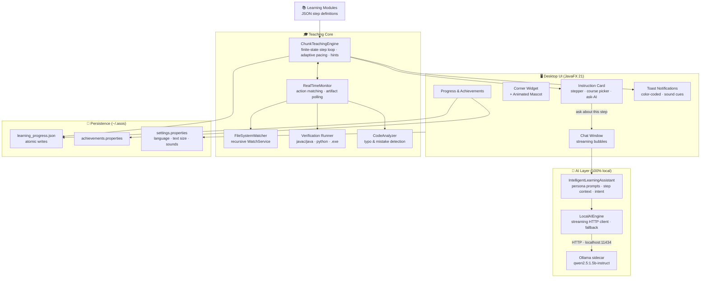
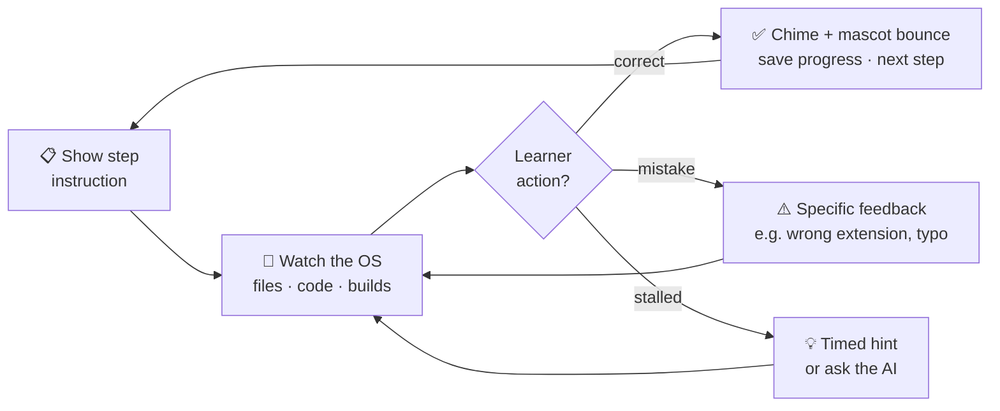

<div align="center">

# আছস? (Asos?)

**An offline-first, AI-powered desktop learning companion that teaches programming by watching you work.**

[](https://openjdk.org/projects/jdk/17/)
[](https://openjfx.io/)
[](https://ollama.com)
[](https://gradle.org/)
[](#-testing)
[](#-license)

*"আছস?" — in everyday Bangla chat, the two-syllable ping that means "Hey, are you there?"*
*— the nudge you send a close friend when you need a quick hand.*

[Demo Video](https://www.youtube.com/watch?v=O6yIGhhhsso) · [Features](#-features) · [Architecture](#-architecture) · [Getting Started](#-getting-started)

</div>

---

## 📖 Overview

Learning to code is hard when every mistake means switching to a browser, describing your problem, and hoping a forum answer fits. **Asos?** removes that loop entirely: a small animated companion sits in the corner of your screen, guides you through programming courses one step at a time, **detects your actual work in real time** (files you create, code you write, programs you compile and run), corrects your mistakes with specific feedback, and answers questions through a **fully local AI model** — no internet connection, no accounts, no data ever leaving your machine.

It is designed for absolute beginners and elderly learners, including regions with limited connectivity — the two audiences for whom "just Google it" fails hardest.

### What makes it different

| | Typical tutorial site | **Asos?** |
|---|---|---|
| Knows what you actually did | ❌ trusts you clicked "next" | ✅ verifies files, code content, compilation, and program output |
| Works offline | ❌ | ✅ 100% — including the AI |
| Mistake feedback | Generic | Specific: *"You created `Hello.txt` but this step needs `Hello.java`"* |
| AI help | Generic chatbot | Knows **exactly which step** you're stuck on |
| Privacy | Tracking, accounts | Zero telemetry; everything stays in `~/.asos/` |

---

## ✨ Features

### 🎓 Teaching Mode — learn by doing, verified in real time
- **3 guided courses** (Java · Python · C++) plus a hello-world tutorial — **26 steps** of hands-on instruction delivered in small, digestible chunks
- **Real-time OS monitoring**: recursively watches Desktop, Documents, Downloads, and the project folder; detects file creation, code content (regex-verified), successful compilation (`.class`/`.exe` artifact detection), and **verifies your program's output by running it**
- **Mistake detection & correction**: wrong file extension or casing, code typos (`Systm` → `System`, `pirnt` → `print`), missing semicolons, missing main method — each with specific, constructive feedback and automatic retry
- **Adaptive pacing**: merges steps for fast learners, offers hints when you stall
- **Progress stepper** on the instruction card (●●●○○ *Step 3 of 5*) and per-course progress bars
- **Resume anywhere**: progress persists atomically to disk; already-created files are recognized when you return

### 🤖 Offline AI Tutor — local LLM via Ollama
- **Qwen2.5 1.5B Instruct** served by an [Ollama](https://ollama.com) sidecar — runs on CPU-only, low-end machines (~1 GB model, ~2–3 GB RAM)
- **Streaming responses**: answers type out token-by-token, ChatGPT-style
- **Context-aware help**: the *"💬 Ask Asos about this step"* button opens chat pre-loaded with your current step — the AI answers about exactly what you're doing
- **Graceful degradation**: if Ollama isn't installed or running, a rule-based responder keeps the app fully usable; the app auto-launches `ollama serve` and reconnects mid-session when it becomes available
- Conversation modes, history-aware multi-turn chat, quick-start suggestions

### 🌐 Bilingual Interface — English & বাংলা
- One-click interface language switch: menus, windows, notifications, teaching messages, and chat chrome all translate **live, no restart**
- The AI answers in the selected language too

### 🎨 Polished, Accessible Desktop UX
- **Animated mascot** with real moods: idle blinking and bobbing, happy bounce on success, worried shake on mistakes, thoughtful look on hints
- Modern dark design system (transparent rounded windows, custom draggable title bars, minimize support, fade-in animations)
- **Color-coded toast notifications** (green success / red mistake / amber hint) that stack and auto-dismiss
- **Text-size setting** (Normal/Large) applied instantly across every window — built for elderly learners
- **Soft synthesized sound cues** (success chime, error tone, hint note) — generated at runtime, zero audio assets, mutable
- **Achievements**: 🥇 First Step, ✋ High Five, 🔟 Perfect Ten, 🏆 Course Champion, 🌟 Polyglot — persisted, with unlock toasts and a trophy wall

---

## 🏗 Architecture



### The teaching loop



### Key components

| Component | Responsibility |
|---|---|
| `ChunkTeachingEngine` | Finite-state teaching loop: instruction → monitor → feedback → advance; adaptive pacing, hint scheduling, progress saves |
| `RealTimeMonitor` | Matches learner actions against expected ones; hybrid event + polling detection; language-aware run verification (Java/Python/C++) |
| `FileSystemWatcher` | Recursive, restartable `WatchService` wrapper reporting absolute paths; auto-registers new subdirectories |
| `LocalAIEngine` | Ollama HTTP client: streaming & non-streaming chat, model discovery, sidecar auto-launch, rule-based fallback |
| `IntelligentLearningAssistant` | Builds persona/learning-style-aware prompts, injects current-step context, post-processes answers |
| `ConversationalInterface` | Chat UI: streaming bubbles, avatars, modes, suggestions |
| `AsosCharacterView` | Vector-drawn animated mascot (no image assets) with event-driven moods |
| `LearningProgressStorage` | Atomic JSON persistence (temp-file + rename) — crash-safe by construction |
| `AchievementManager` | Threshold evaluation over saved progress; persistent unlocks |
| `I18n` | English/বাংলা translation layer with safe English fallback |

---

## 🚀 Getting Started

### Prerequisites

- **Java 17** (LTS)
- **Gradle** 8+
- **[Ollama](https://ollama.com)** — optional but recommended, for real AI answers

### 1 · One-time AI setup (optional)

```bash
winget install Ollama.Ollama            # or download from https://ollama.com
ollama pull qwen2.5:1.5b-instruct       # ~1 GB, one-time download
```

After this download everything runs **fully offline**. Without Ollama, the app still works — chat degrades to rule-based answers.

### 2 · Build & run

```bash
git clone https://github.com/<your-username>/asos.git
cd asos
gradle run
```

The companion appears in the lower-right corner. Open the **⋯ menu → Start Tutorial**, pick a course, and create the file it asks for — Asos detects it and moves you forward.

### 3 · Run the tests

```bash
gradle test
```

### Configuration

| Setting | How |
|---|---|
| AI model | `-Dasos.ollama.model=llama3.2:1b` (default `qwen2.5:1.5b-instruct`) |
| Ollama URL | `-Dasos.ollama.url=http://localhost:11434` |
| Language / text size / sounds | In-app: **⋯ menu → Settings** (persisted to `~/.asos/settings.properties`) |

---

## 🧪 Testing

**29 automated tests** guard the pipeline end to end — several are true integration tests that operate on the real filesystem and the live local model:

- **Detection integration**: creates real files on disk and asserts the watcher → matcher → step-completion chain fires, *including after a stop/restart cycle*
- **Run verification**: writes a real Python script and asserts Asos executes it and validates its output
- **AI streaming**: streams from the live Ollama model and asserts the token pieces reassemble into exactly the final response *(auto-skips when Ollama is absent)*
- **Persistence round-trip**: save → reload on a real file, guarding against the serialization truncation bug it originally caught
- **Progress arithmetic, achievements, i18n, module schemas**: unit-tested

---

## 📁 Project Structure

```
src/
├── main/
│   ├── java/com/asos/            # 41 classes, ~12.7k LOC
│   │   ├── AsosApplication.java  # UI shell: windows, menu, notifications
│   │   ├── ChunkTeachingEngine.java
│   │   ├── RealTimeMonitor.java
│   │   ├── LocalAIEngine.java
│   │   ├── IntelligentLearningAssistant.java
│   │   ├── ConversationalInterface.java
│   │   ├── AsosCharacterView.java
│   │   └── ...
│   └── resources/
│       ├── learning-modules/     # course step definitions (JSON)
│       ├── dark-theme.css        # design system
│       └── large-text.css        # accessibility overlay
└── test/java/com/asos/           # 29 tests across 8 suites
```

---

## 🧠 Engineering Notes

- **Why Ollama instead of raw ONNX?** An early iteration targeted Gemma 270M through ONNX Runtime directly, which meant hand-building tokenization and the autoregressive generation loop — impractical to make reliable, and the 270M model was too weak for tutoring. Delegating model serving to an Ollama sidecar over its local HTTP API removed an entire class of low-level inference code while keeping the app 100% offline, and enabled a stronger model.
- **Why artifact detection instead of terminal capture?** No desktop app can read what a learner types into their own terminal. Compilation is instead proven by the compiler's output file appearing, and program correctness by Asos running the compiled program itself and checking its output — observable, reliable signals.
- **Crash-safe persistence**: progress writes go to a temp file first, then an atomic rename — a kill mid-save can never corrupt saved progress. (This design caught and survived a real serialization bug in testing.)

## 🗺 Roadmap

- [ ] Markdown + syntax-highlighted code blocks in AI chat
- [ ] JavaScript course
- [ ] Native installer via `jpackage` (double-click install, no Gradle)
- [ ] System-tray integration
- [ ] Text-to-speech instructions (offline, for accessibility)
- [ ] Post-course AI-generated quiz mode

## 👥 Team

Built by **Team CodeWeavers** — Muftasim Fuad Mahee & Maidul Islam.

📺 [Watch the demo — "Asos? Part 1"](https://www.youtube.com/watch?v=O6yIGhhhsso)

## 📄 License

MIT — see [LICENSE](LICENSE).
